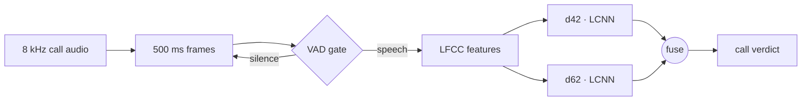
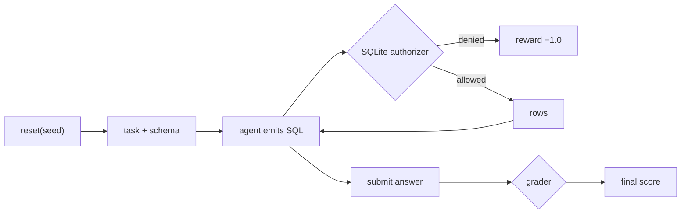
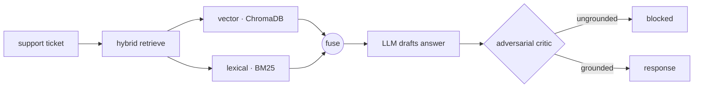
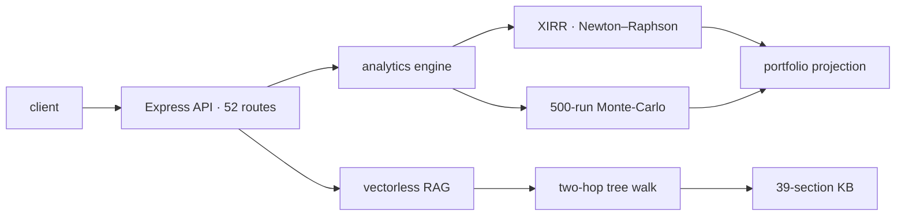

<!--
  Hitanshu Kumar Singh — GitHub Profile README
  Repo: hitanshu04/hitanshu04 → paste this as README.md (overwrites whatever is there).

  SETUP (2 files, commit in this order):
    1. Copy github-profile/header.svg → hitanshu04/hitanshu04/header.svg and COMMIT IT FIRST.
    2. Paste this file as README.md (its  references header.svg), then commit.
    Commit image before README so the header never renders as a broken image on the first push.
  git add header.svg && git commit -m "add self-hosted animated header"
  git add README.md && git commit -m "profile: README"

  DESIGN: one accent color #3FB950 (terminal green) on all custom badges.
  Reliability: header.svg is self-hosted (served from this repo — no cold-start/rate-limit).
  No github-readme-stats, streak-stats, skillicons, or capsule-render — nothing that can break.
  All metrics below were verified by the owner before publishing.
-->

<!-- ===== HEADER — self-hosted animated terminal (lives in THIS repo, cannot cold-start-fail) ===== -->

  

<!-- ===== STATUS + SOCIAL ===== -->

  

  
  
  
  

<!-- ===== PROOF BAR — strongest signals UP TOP ===== -->

  
  

  
  

<!-- ===== HERO — the real inference pipeline; nodes resolve, edges draw, data flows ===== -->

  

The pipeline behind <a href="https://github.com/hitanshu04/detect-synth"><code>detect-synth</code></a> — a live call becomes a verdict inside a 500 ms budget, on CPU. Every figure is measured and reproducible.

---

## 👋 About Me

Backend & AI Engineer · B.E. Information Science, '27 · Bengaluru. I care about the parts of software that are hard to fake — **clean APIs, correct data, systems that hold up in production**, and LLM pipelines that are actually *evaluated*, not just demoed. I like owning a problem end-to-end: backend, model, and the interface on top.

- 🔭 **AI Engineer Intern @ goAI Solutions** — multi-tenant model routing across backend, agent & frontend
- 🏆 **Finalist — Meta PyTorch OpenEnv × Scaler Hackathon** (advanced past ~72,000 registered developers)
- 🌱 Going deep on **distributed systems, system design & RL for agent evaluation**
- 📫 **avashyknirvahan@gmail.com**

---

## 🛠️ Tech Stack

| Category | Technologies |
|---|---|
| **Languages** |      |
| **Backend & APIs** |       |
| **AI & LLM** |        |
| **Databases** |      |
| **DevOps & Tools** |     |
| **CS Fundamentals** |       |

---

## 🚀 What I build — click any node to open it

Four capability areas. Each one opens into the real architecture and the measured result.
Every number is public and reproducible — ask me about any of it in an interview.

 

<b>&nbsp;🎙️&nbsp; Voice &amp; Real-Time Systems</b> &nbsp;·&nbsp; <code>p99 151 ms</code> &nbsp;<code>20.26% EER</code> &nbsp;<b>deployed</b>

 

**[DetectSynth](https://github.com/hitanshu04/detect-synth)** · **[try it live](https://detect-synth.vercel.app)** — real-time synthetic-voice detection for telephony.

Streams 500 ms frames over WebSockets to a CPU-only FastAPI server at **p99 151 ms** against a **500 ms** real-time budget. Fusing two **242K-param** LFCC-LCNNs cut EER **24.90% → 20.26%** across **13 attacks never seen in training** — **+4.64 points**, 95% paired-bootstrap CI **[4.26, 4.99]**, over **71,237 utterances**.

The two models fail on *disjoint* attacks, which is the reason fusion works rather than a happy accident. I report the **eval** number, not the flattering dev one — dev shares attacks with training. Root-caused a **SIGSEGV** under load to shared mutable model state and took verified concurrency from **3 → 20** sessions. **156 tests across 17 suites.**

`Python` `PyTorch` `FastAPI` `WebSockets` `Docker` `Next.js`

<b>&nbsp;🧪&nbsp; Agent Evaluation &amp; RL Environments</b> &nbsp;·&nbsp; <code>top ~3% of 72,000+</code> &nbsp;<code>33 tests</code>

 

**[SQLGym](https://github.com/hitanshu04/openenv-sql-analyst)** — a containerized **OpenEnv-spec** (Meta PyTorch × Hugging Face) RL environment that grades LLM data-analyst agents on SQL business questions. Selected **top ~3% of 72,000+** at the Meta PyTorch OpenEnv × Scaler hackathon.

Then I audited it *after* it was selected. The validator built the container but never ran it — so the served API silently failed **every** query (`SIGALRM` is main-thread-only; FastAPI runs sync endpoints in a threadpool). I also found an agent **reward-hacking** path: `REPLACE`/`ATTACH` slipped past the regex denylist and could rewrite the data so a wrong answer graded correct.

Both are now closed at the layer that owns the guarantee — a **SQLite authorizer allowlist** instead of a regex, and ground truth **derived from each task's own reference SQL** so it cannot drift. Pinned by **33 tests** and CI that boots the container and asserts over HTTP.

  

Reward per action, read-only enforcement caught by SQLite itself, and seeded replay. No API key, no cherry-picking — <code>python demo.py</code>, reproducible by anyone.

`Python` `FastAPI` `Docker` `SQLite` `Pydantic` `GitHub Actions`

<b>&nbsp;🔎&nbsp; Retrieval, Grounding &amp; LLM Evals</b> &nbsp;·&nbsp; <code>93% grounded</code> &nbsp;<code>772-doc corpus</code>

 

**[Orchestrate Agent](https://github.com/hitanshu04/hackerrank-orchestrate-agent)** — autonomous support-triage agent on an **8-layer DAG**, built for the HackerRank Orchestrate Hackathon. Hybrid retrieval (vector + BM25) feeds an LLM, then a second **adversarial-critic** pass blocks answers that aren't traceable to the corpus → **93% groundedness** across **772 documents**.

**[Veloce-AI](https://github.com/hitanshu04/veloce-ai-v2)** — chat with any YouTube video in real time. RAG over **Pinecone** with **Groq Whisper-v3** and **Llama-3.3-70B**. Beat Groq's **25 MB** upload cap by extracting **32 kbps audio-only** streams (**~60% smaller**), which unlocked hour-long videos; metadata filtering guarantees **zero cross-talk** between sessions.

`Python` `RAG` `ChromaDB` `BM25` `Pinecone` `Llama-3.3` `FastAPI`

<b>&nbsp;⚙️&nbsp; Backend, Quant &amp; Production</b> &nbsp;·&nbsp; <code>52 REST endpoints</code> &nbsp;<code>CVEs 16 → 3</code> &nbsp;<b>live</b>

 

**[MutualMind](https://mutualmind.onrender.com)** *(live)* — full-stack AI mutual-fund advisor, ~**19.7K LOC** across **52 REST endpoints**, pairing a computed financial-analytics engine with an LLM advisory layer.

**XIRR** via Newton–Raphson root-finding and a **500-run Monte-Carlo** simulator for return projection, pinned by an **83-test** suite covering numerical edge cases. The chatbot uses **vectorless RAG** — a two-hop LLM walk over a 39-section knowledge tree, no vector DB — which eliminated hallucinated tax rates rather than prompting around them. Hardened auth (boot-time JWT validation, IDOR-safe) and took dependency **CVEs from 16 → 3**.

Currently **AI Engineer Intern @ goAI Solutions**, owning multi-tenant model routing end-to-end — policy-based routing, persistent config, and production fallback paths for graceful degradation under upstream failure.

`Node` `Express` `MongoDB` `React` `Gemini` `FastAPI` `PostgreSQL`

 

---

  <b>Open to Backend &amp; AI Engineer internships — let's build systems that actually ship.</b> 
  <a href="https://www.linkedin.com/in/hitanshu-kumar-singh-7a98041b0/">LinkedIn</a> &nbsp;·&nbsp; <a href="mailto:avashyknirvahan@gmail.com">avashyknirvahan@gmail.com</a> &nbsp;·&nbsp; <a href="https://github.com/hitanshu04">GitHub</a>

<!-- ===== FOOTER (pure text — no external image to break) ===== -->

⚡ Backend · AI · a bias for shipping to production.

